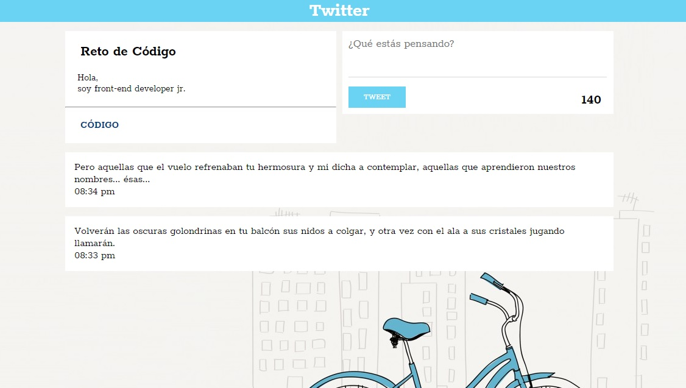

# Reto de Código - Twitter #

## Objetivo

Este reto consiste en replicar el newsfeed de Twitter, para ello se seguirá un flujo de versiones (requerimientos) que se detallan líneas abajo.

A continuación, una vista de la página:

## Versiones

#### Versión 0.0.1

1. Diseñar un formulario que permita ingresar un texto y un botón para "twittear".
2. Agregar un evento de click al botón o de submit al formulario.
3. En el evento, obtener el texto.
4. Agregar el texto al HTML.

#### Versión 0.0.2

1. No ingresar texto vacío (deshabilitar el botón de "twittear").
2. Contar la cantidad de caracteres de forma regresiva.

#### Versión 0.0.3

1. Si pasa los 140 caracteres, deshabilitar el botón.
2. Si pasa los 120 caracteres, mostrar el contador con OTRO color.
3. Si pasa los 130 caracteres, mostrar el contador con OTRO color.
4. Si pasa los 140 caracteres, mostrar el contador en negativo.

#### Versión 0.0.4

1. Al presionar enter(/n) que crezca el textarea de acuerdo al tamaño del texto.

## Especificaciones
* El archivo index.html contiene la estructura de la página, y se enlaza con dos archivos: main.css y app.js.
* En la carpeta “css” se almacena el archivo main.css usado para dar estilo y diseño a la página.
* En la carpeta “js” se almacena el archivo app.js usado para dar funcionalidad a la página.
* En la carpeta “assets” se almacenan las imágenes utilizadas como fondo de la página y en el Readme.md.
* En el archivo Readme.md se explica el contenido de este repositorio.
* Esta página utiliza la tipografía Rokkitt.
* La paleta de colores son los siguientes: #6ad2f3, #d6dadc, #004080, # feae22, #e0245e.
